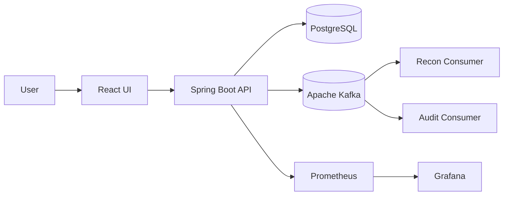
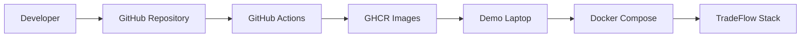

# TradeFlow Architecture

## Runtime architecture

```mermaid
flowchart LR
    User[User] --> React[React UI]
    React --> Backend[Spring Boot API]
    Backend --> Postgres[(PostgreSQL)]
    Backend --> Kafka[(Apache Kafka)]
    Kafka --> Recon[Recon Consumer]
    Kafka --> Audit[Audit Consumer]
    Backend --> Prom[Prometheus]
    Prom --> Grafana[Grafana]
```

## CI/CD and deployment flow

```mermaid
flowchart LR
    Dev[Developer] --> GitHub[GitHub Repository]
    GitHub --> Actions[GitHub Actions]
    Actions --> GHCR[GHCR Images]
    GHCR --> Laptop[Demo Laptop]
    Laptop --> Compose[Docker Compose]
    Compose --> Stack[TradeFlow Stack]
```
